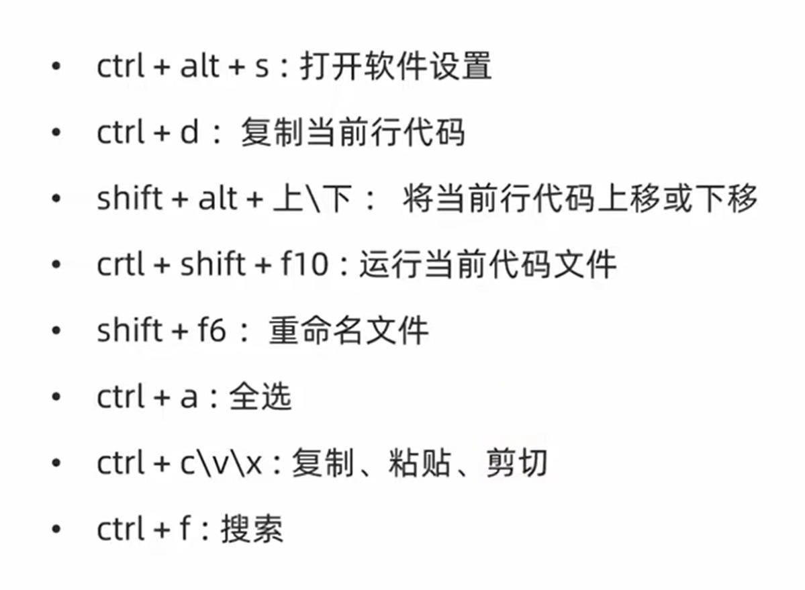

# 快捷键

|  运算符   |     描述      |        实例         |
|:------:|:-----------:|:-----------------:|
|  `+=`  |  `加法赋值运算符`  |  `c+=a等效于c=c+a`   |
|  `-=`  |  `减法赋值运算符`  |  `c-=a等效于c=c-a`   |
|  `*=`  |  `乘法赋值运算符`  |  `c*=a等效于c=c*a`   |
|  `/=`  |  `除法赋值运算符`  |  `c/=a等效于c=c/a`   |
|  `%=`  |  `取模赋值运算符`  |  `c%=a等效于c=c%a`   |
| `**=`  |  `幂赋值运算符`   | `c**=a等效于c=c**a`  |
| `//=`  | `取整除赋值运算符`  | `c//=a等效于c=c//a`  |