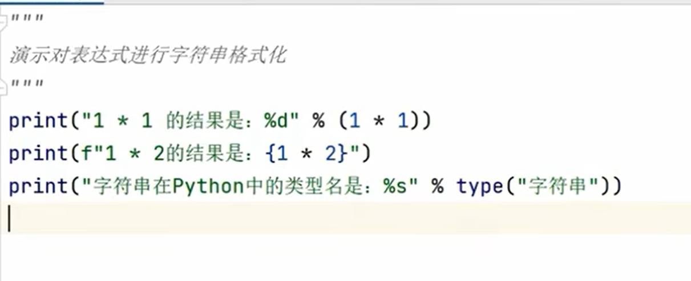
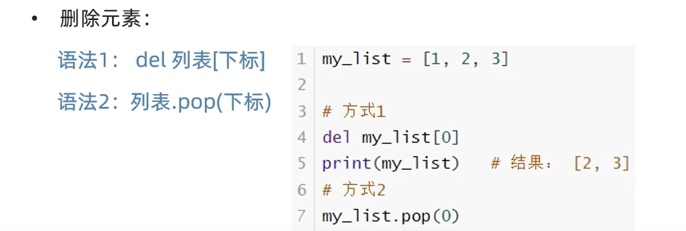
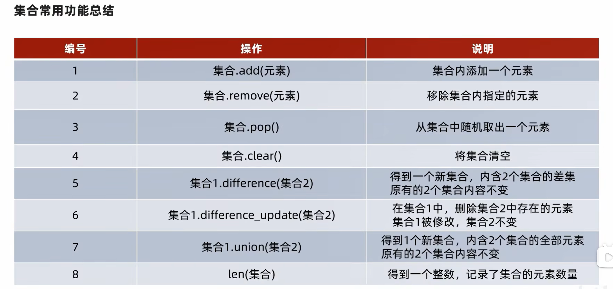
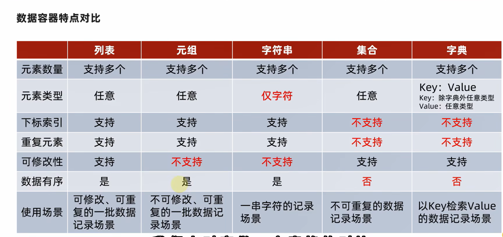
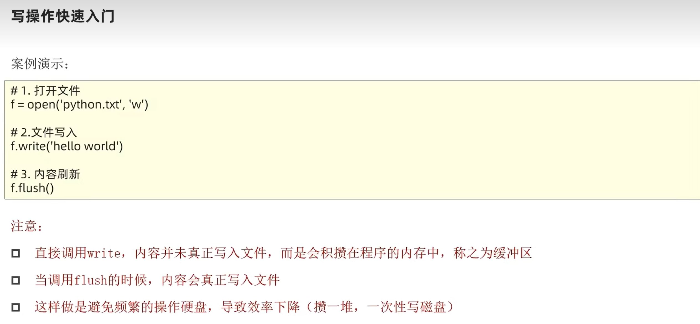

# 快捷键

# 运算符

|  运算符   |     描述      |        实例         |
|:------:|:-----------:|:-----------------:|
|  `+=`  |  `加法赋值运算符`  |  `c+=a等效于c=c+a`   |
|  `-=`  |  `减法赋值运算符`  |  `c-=a等效于c=c-a`   |
|  `*=`  |  `乘法赋值运算符`  |  `c*=a等效于c=c*a`   |
|  `/=`  |  `除法赋值运算符`  |  `c/=a等效于c=c/a`   |
|  `%=`  |  `取模赋值运算符`  |  `c%=a等效于c=c%a`   |
| `**=`  |  `幂赋值运算符`   | `c**=a等效于c=c**a`  |
| `//=`  | `取整除赋值运算符`  | `c//=a等效于c=c//a`  |

# 字符串格式化

# 比较运算符

# 列表的定义

# 列表查询功能

# 列表的修改功能

# 列表插入元素

# 列表的追加元素

# 列表追加元素②

# 列表的删除元素

# 删除元素

# 列表的清空

# 统计某元素在列表中的数量

# 统计列表内总共有多少元素

# 列表的方法总览

# 元组

# 字符串的替换

# 字符串的分割

# 字符串的规整

# 字符串汇总

# 序列的常用操作
# ①切片

# 基本定义

# 集合的差集

# 消除集合中的差集

# 集合的合并

# 集合的常用功能

# 字典
# 字典的定义

# 字典的常用操作
# 字典的新增与更新

# 字典的删除与清空

# 字典获取全部key

# 字典的常用操作

# 数据容器基本特点对比

# 容器通用的排序功能

# 容器的通用功能

# 字符串大小比较

# 函数返回值

# 函数参数种类

# 匿名函数(lambda)

# 文件

